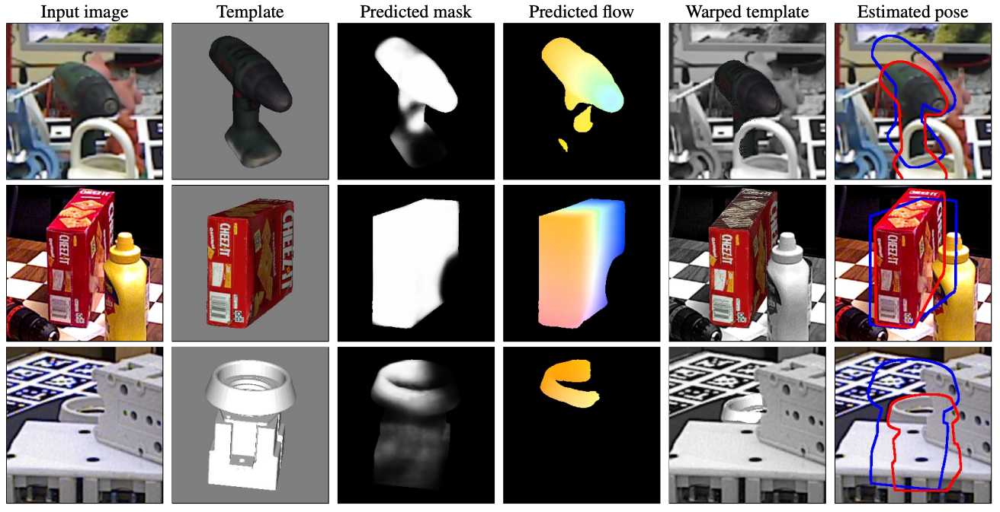
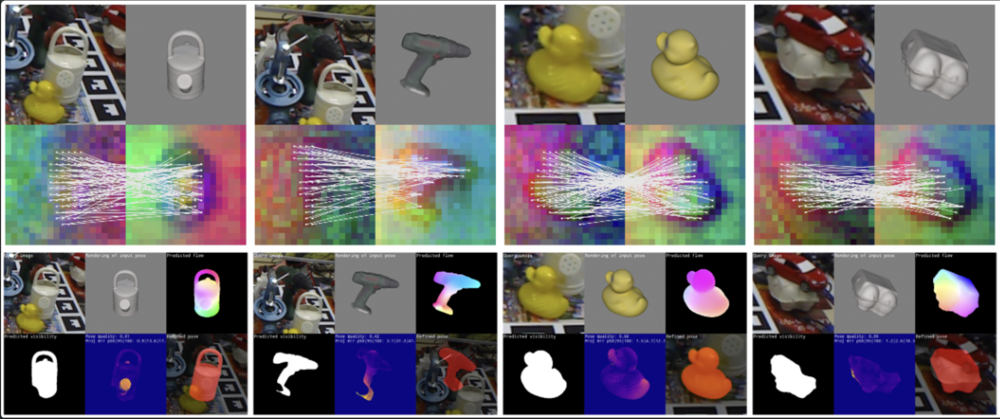
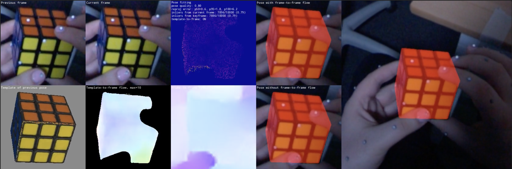
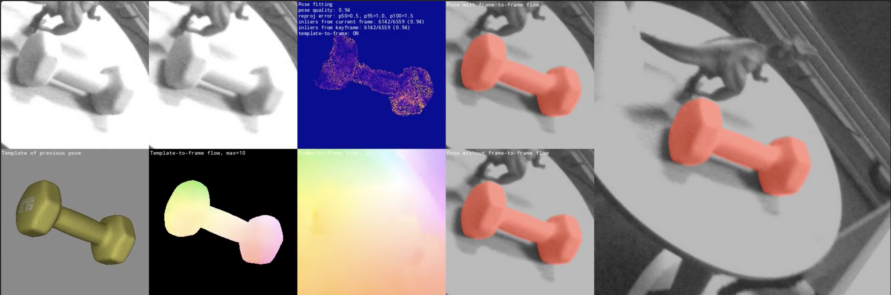
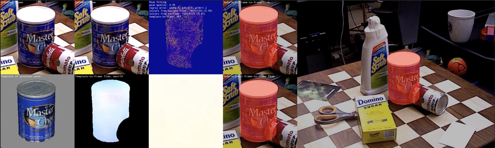

<p align="center">
  <h2 align="center"> GoTrack: Generic 6DoF Object Pose Refinement and Tracking</h2>
  <p align="center">
    <a href="https://nv-nguyen.github.io/">Van Nguyen Nguyen</a>
    ·
    <a href="https://www.cforster.ch">Christian Forster</a>
    ·
    <a href="https://www.linkedin.com/in/sindi-shkodrani/">Sindi Shkodrani</a>
    ·
    <a href="https://btekin.github.io">Bugra Tekin</a><br>
    ·
    <a href="https://vincentlepetit.github.io/">Vincent Lepetit</a>
    ·
    <a href="https://www.linkedin.com/in/cem-keskin-23692a15">Cem Keskin</a>
    ·
    <a href="https://thodan.github.io/">Tomas Hodan</a>
  </p>
</p>

##

This is the official implementation of our work **GoTrack** which proposes an efficient and accurate CAD-based method for 6DoF pose refinement and tracking of **unseen** objects. Given a CAD model of an object, an RGB image with known intrinsics that shows the object in an unknown pose, and an initial object pose, Gotrack refines the object pose such as the 2D projection of the model aligns closely with the object’s appearance in the image.

We also incorporate two existing methods for 2D object detection and coarse pose estimation, [CNOS](https://github.com/nv-nguyen/cnos) and [FoundPose](https://github.com/facebookresearch/foundpose) (also built on top of [DINOv2](https://github.com/facebookresearch/dinov2)), respectively, to have a three-stage pose estimation pipeline. Note that the results of CNOS and FoundPose are slightly different from the original implementations, as we have simplified the setup and used consistent image resolutions and rendering settings across all three methods.

Additionally, this repo supports the fisheye camera model used in the [HOT3D](https://www.projectaria.com/datasets/hot3D/) dataset.

<figure align="left">
  
  <figcaption>
      <b>Example results of the GoTrack refiner on LM-O, YCB-V, and T-LESS datasets.</b> The input image is shown in the first column, and the template retrieved using the BoW-based approach from 
    <a href="https://github.com/facebookresearch/foundpose">FoundPose</a> in the second. The third and fourth columns show the predictions 
    of our GoTrack network, which can then be used to remap pixels from the template to the input image as shown in the fifth column. 
    The last column presents the final pose estimated by PnP-RANSAC from 2D-3D correspondences (the contour of the object model in the 
    initial pose is shown in blue, and in the estimated pose in red). As shown in the third column, our method can reliably predict which 
    part of the object is visible, despite never seeing the object during training.
  </figcaption>
</figure>


## Table of Contents

- [Setup](#setup)
   - [Environment](#environment)
   - [Dataset](#dataset)
   - [Dataset Directory Structure](#dataset-directory-structure)
- [Using GoTrack](#gotrack)
   - [Pose refinement](#pose-refinement)
   - [Pose estimation pipeline ](#pose-estimation-pipeline)
- [Qualitative tracking results](#qualitative-tracking-results)
- [Acknowledgements](#acknowledgements)
- [License](#license)

## Setup <a name="setup"></a>

<details><summary>Click to expand</summary>

This repository uses [hydra](https://github.com/facebookresearch/hydra) to manage the configuration files. Please make sure that you update ```root_dir``` the user's configuration located at ```configs/user/default.yaml``` before conducting any experiments.

### Environment <a name="environment"></a>

Download the code with the git submodules, navigate to the folder, and setup the [conda](https://docs.conda.io/projects/conda/en/latest/user-guide/getting-started.html) environment:

```bash
git clone --recurse-submodules https://github.com/facebookresearch/gotrack
cd gotrack
conda env create -f environment.yml
bash scripts/env.sh # bop_toolkit and dinov2
```

### Dataset <a name="dataset"></a>

For pose refinement, download the [BOP datasets](https://bop.felk.cvut.cz/datasets/) and the predictions of coarse pose methods from the [BOP Challenge](https://bop.felk.cvut.cz/leaderboards/) ([FoundPose](https://bop.felk.cvut.cz/method_info/507/), [GigaPose](https://bop.felk.cvut.cz/method_info/529/)):
```bash
# BOP-Classic-Core datasets
python -m scripts.download_bop_classic_core
python -m scripts.download_coarse_poses_bop_classic_core
python -m scripts.download_default_detections_bop_classic_core

# BOP-H3 datasets
python -m scripts.download_bop_h3
python -m scripts.download_default_detections_bop_h3
```

### Directory Structure <a name="dataset-directory-structure"></a>

After downloading, the datasets should be organized in the following directory structure:

```bash
bop_datasets/               # This is your $BOP_PATH
├── lmo/                    # Dataset directory for LM-O
│   ├── camera.json
│   ├── dataset_info.md
│   ├── models/             # 3D models of the objects
│   ├── models_eval/        # Simplified models for evaluation
│   ├── test/               # Test images and annotations
│   └── ...
├── tudl/
├── ...
├── default_detections/
│   ├── classic_bop23_model_based_unseen/
│       └── cnos-fastsam/
│           ├── cnos-fastsam_ycbv-test_f4f2127c-6f59-447c-95b3-28e1e591f1a1.json
│           └── ...
├── coarse_poses/
│   ├── foundPose/
│       ├── foundPose_ycbv-test_f4f2127c-6f59-447c-95b3-28e1e591f1a1.json
│       ├── ...
│   ├── gigaPose/
│       ├── ...
```

</details>

## Using GoTrack <a name="GoTrack"></a>

<details><summary>Click to expand</summary>

### Pose refinement <a name="pose-refinement"></a>

```bash
export DATASET_NAME=lmo
export COARSE_POSE_METHOD=foundpose # or gigaPose
python -m scripts.inference_gotrack mode=pose_refinement dataset_name=$DATASET_NAME coarse_pose_method=$COARSE_POSE_METHOD
```

Similar to [FoundPose](https://github.com/facebookresearch/foundpose), we report the results produced by this open-source repository and compare them with the published results. The main difference between the implementation used to get the scores reported in the paper and the open-source implementation is the renderer (for the paper we used an internal renderer):

| Dataset   | Published AR  | Reproduced AR |
|-----------|---------------|---------------|
| LMO       | 56.5          | 56.2          |
| T-LESS    | 50.4          | 48.5          |
| YCB-V     | 63.1          | 62.9          |

### Pose estimation (detection, coarse, refinement) <a name="pose-estimation-pipeline"></a>

Using the command below to run the three-stage pose estimation pipeline built on top of the frozen features of [DINOv2](https://github.com/facebookresearch/dinov2): 2D object detection ([CNOS](https://github.com/nv-nguyen/cnos)), coarse pose estimation ([FoundPose](https://github.com/facebookresearch/foundpose)), and refinement (GoTrack):
```bash
export DATASET_NAME=lmo
python -m scripts.inference_pose_estimation dataset_name=$DATASET_NAME mode=localization

# For using the default detections
python -m scripts.inference_pose_estimation dataset_name=$DATASET_NAME mode=localization model.use_default_detections=true
```
Note that when```fast_pose_estimation=true```, the pipeline retrieves only the nearest template during the coarse pose estimation stage (used in FoundPose), and use ```num_iterations_refinement=1``` for pose refinement stage. These settings help speed up the inference time. Below are the visualization results of the pipeline on the LMO dataset:

<p align="center">
  
</p>
</details>

## Qualitative tracking results <a name="qualitative-tracking-results"></a>

On HOT3D dataset (Aria):

[](https://youtu.be/74NXe03ySdM)

On HOT3D dataset (Quest 3):

[](https://youtu.be/bjQWS9vgPT0)


On YCB-V dataset:

[](https://youtu.be/6B1ZOQkvxH4)


<div align="center">
  <a href="https://www.youtube.com/watch?v=6B1ZOQkvxH4" style="display: inline-block; position: relative;">
    
    
  </a>
</div>


## Acknowledgements <a name="acknowledgements"></a>

If you find this work useful in your research, please cite

```
@article{
  nguyen2025gotrack,
  author    = {Nguyen, Van Nguyen and Forster, Christian and Tekin, Bugra and Shkodrani, Sindi and Lepetit, Vincent and Keskin, Cem and Hoda{\v{n}}, Tom{\'a}{\v{s}}},
  title     = {GoTrack: Generic 6DoF Object Pose Refinement and Tracking},
  journal   = {Computer Vision and Patern Recognition Workshops (CVPRW)},
  year      = {2025},
}
```

Thanks to the following repositories: [FoundPose](https://github.com/facebookresearch/foundpose), [GigaPose](https://github.com/nv-nguyen/gigapose), [PFA](https://github.com/cvlab-epfl/perspective-flow-aggregation), [MegaPose](https://github.com/megapose6d/megapose6d), [CNOS](https://github.com/nv-nguyen/cnos), [DINOv2](https://github.com/facebookresearch/dinov2), [BOP Toolkit](https://github.com/thodan/bop_toolkit/tree/master), [DPT](https://github.com/isl-org/DPT), [Crocov2](https://github.com/naver/croco), and [Dust3r](https://github.com/naver/dust3r).

## License <a name="license"></a>

This project is licensed under the [Creative Commons Attribution-NonCommercial 4.0 International License (CC BY-NC 4.0)](http://creativecommons.org/licenses/by-nc/4.0/). [](http://creativecommons.org/licenses/by-nc/4.0/)
